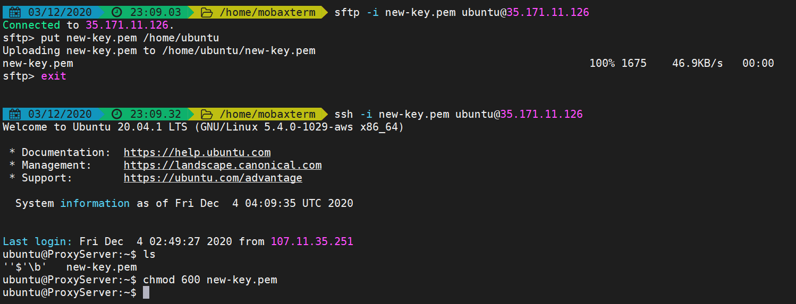
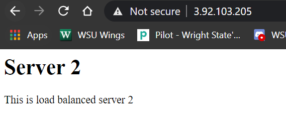
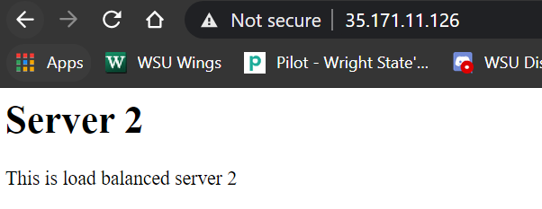

# Changelog Project 2-3

## Part 1

### Stand up proxy server (HAProxy)
### Stand up two apache servers

### 12/3/2020 6:00pm

- Done within the proxy-config.yml file in the CloudFormations directory

- Placed index-serv1.html & index-serv2.html on each server using wget command
- Added a command to change each servers hostname
- Added the haproxy configurations through wget from the project 2 folder and copied them to /etc/haproxy/haproxy.cfg
- Also added the sudo systemctl restart haproxy command to automatically restart HAProxy after the configs have been updated
- ProxySever Private IP: 10.0.0.30
- Apache1 Private IP: 10.0.0.20
- Apache2 Private IP: 10.0.0.25

### Create a private / public key

### 12/3/2020 8:00pm

- Added the public key to each server with an echo command to /home/ubuntu/.ssh/authorized_keys
- Added the private key to the proxy server with sftp and ran chmod 600 command on the key file to make it more secure

- Evidence of ssh into the Apache1 server from the ProxyServer with the new-key

### Security Groups

### 12/3/2020 6:00pm

- I just changed the security groups within the proxy-config.yml file

### RoundRobin

### 12/3/2020 8:30pm

- Apache1 Server

- Apache2 Server

- ProxyServer with both index.html files

## Part 2

### Apache1 Server & Apache2 Server

### 12/4/2020 2:00pm

- Within my Apache1 & Apache2 servers I created a git repository called mastersite1 & mastersite2 with the git init --bare command

### Hook Script 

### 12/4/2020 2:30pm

- I manually added the hook script within a file called post-receive in the hooks directory on each Apache server repo and then ran a chmod a+x on both files to make them exectuable
- Within my scripts directory I added a hooky1 and hooky2 script for each Apache server so that they would've displayed different messages after a git push, but since wget won't work with our github accounts I just used hooky from the Project 2 folder

### Local Machine

### 12/4/2020 3:00pm

- On my local machine I added each of the servers as hosts to my .ssh/config file shown below

- I then did a git clone of each servers repos and then cd'd into the Apache1 repo called mastersite1 and created an index.html file different from the one already on the Apache1 server
- After this I did a git add, git commit -m, and a git push in order to push the new changes to index.html to the Apache1 server

- In order to deploy to multiple servers I added the other server as a remote branch and then pushed to it from my local machine for both repos wiht the git remote add command

- Now I can run a git push Apache2 and also push the index.html file to the Apache2 server.

### Hook Automation

- For the hook automation I added commands to my proxy-config.yml file to create a bare repo on each Apache server
- A command to wget hooky from the Project 2 folder and copy it to the post-receive file within mastersite
- A command to make the post-receive file executable
