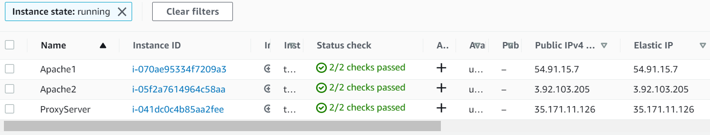
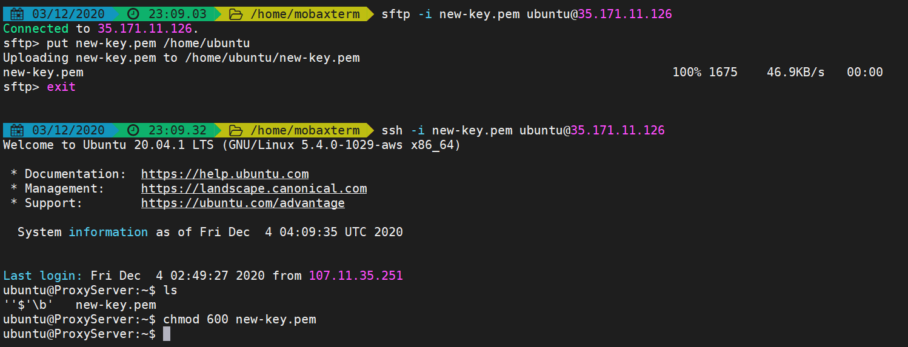
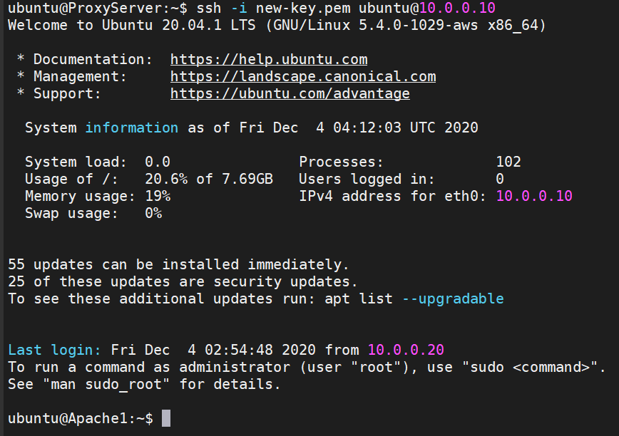
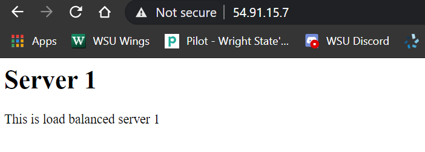
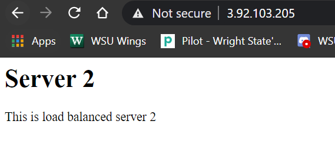
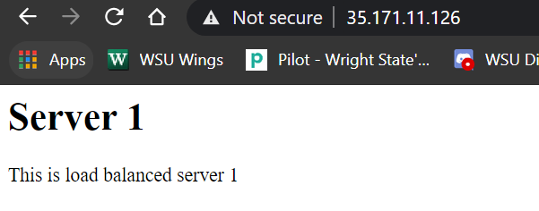
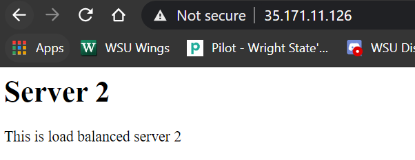

# Project 2  

## Changelog Project 2-1  

### Create a VPC on AWS  

### 10/29/2020 6:15pm
 
- Added a VPC called 3120VPC with default security rules.
- VPC ID: vpc-046a30e9545971e64
  

### Create a code repository

### 10/31/2020 9:00pm

- Created a code repository with git server.  
- Created a git user and then added a user called rreid and then added the Project-2 repository within the rreid directory.
- Used this link for guidance: https://www.digitalocean.com/community/tutorials/how-to-set-up-a-private-git-server-on-a-vps  

### OpenLDAP server

### 10/31/2020 10:30pm

- Created an openLDAP server
- DNS Domain Name: ldapServer.com
- Organization Name: ldapServer
- ldap admin passwd: ldap
- Used this link for guidance: https://www.linuxbabe.com/ubuntu/install-configure-openldap-server-ubuntu-16-04

### Attach IPs to each Instance

### 10/31/2020 10:00pm

- Created an Instance for the ldap server
- Instance uses a t2.micro server
- Git Server IP: 18.204.147.69

### 10/30/2020 7:30pm

- Created an Instance to manually install git server called 3120-Instance
- Instance uses a t2.micro server
- Git Server IP: 54.204.130.228

### Update VPC Security Rules

### 10/30/2020 7:00pm

- Changed the security rules for my VPC
- Added inbound rules for ssh, http, https & ldap

## Changelog Project 2-3

### Stand up proxy server (HAProxy)
### Stand up two apache servers

### 12/3/2020 6:00pm

- Done withtin the proxy-config.yml in the CloudFormations directory

- Placed index-serv1.html & index-serv2.html on each server using wget command
- Added a command to change each servers hostname
- Added the haproxy configurations through wget from the project 2 folder and copied them to /etc/haproxy/haproxy.cfg
- Also added the sudo systemctl restart haproxy command to automatically restart HAProxy after the configs have been upadted
- ProxySever Private IP: 10.0.0.30
- Apache1 Private IP: 10.0.0.20
- Apache2 Private IP: 10.0.0.25

### Create a private / public key

### 12/3/2020 8:00pm

- Added the public key to each server with an echo command to /home/ubuntu/.ssh/authorized_keys
- Added the private key to the proxy server with sftp and ran chmod 600 command on the key file to make it more secure

- Evidence of ssh into the Apache1 server from the ProxyServer with the new-key

### RoundRobin

### 12/3/2020 8:30pm

- Apache1 Server

- Apache2 Server

- ProxyServer with both index.html files

