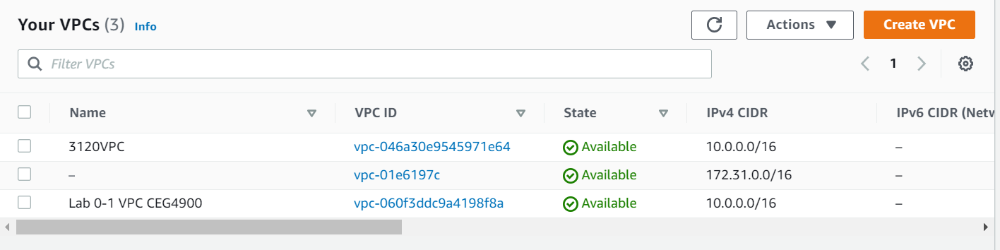
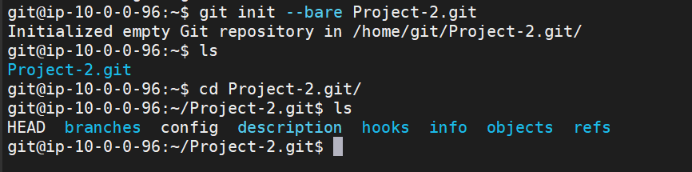
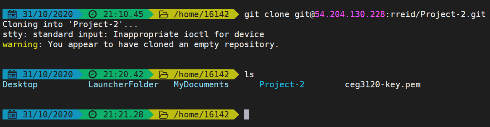
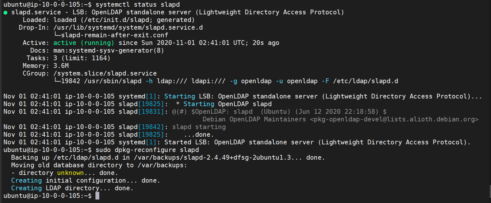
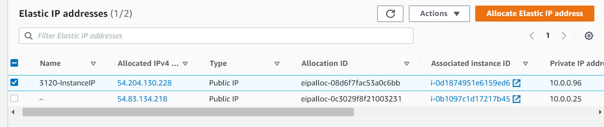
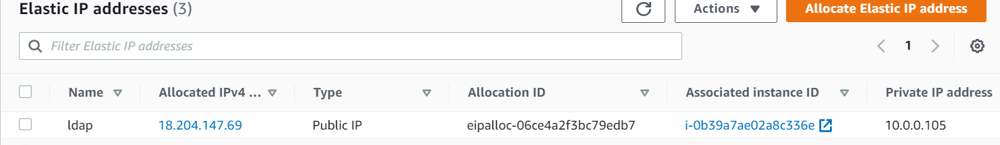
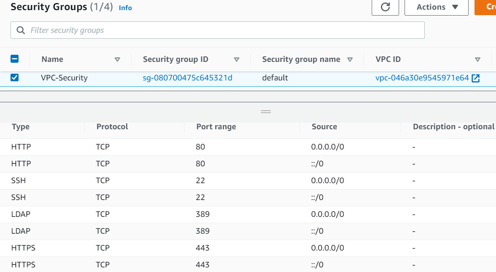

# Project 2  

## Changelog Project 2-1  

### Create a VPC on AWS  

### 10/29/2020 6:15pm
 
- Added a VPC called 3120VPC.  
- VPC ID: vpc-046a30e9545971e64
  

### Create a code repository

### 10/31/2020 9:00pm

- Created a code repository with git server.  
- Created a git user and then added a user called rreid and then added the Project-2 repository within the rreid directory.  
- Used this link for guidance: https://www.digitalocean.com/community/tutorials/how-to-set-up-a-private-git-server-on-a-vps  

### Create an OpenLDAP server

### 10/31/2020 10:30pm

- Created an openLDAP server
- DNS Domain Name: ldapServer.com
- Organization Name: ldapServer
- ldap admin passwd: ldap
- Used this link for guidance: https://www.linuxbabe.com/ubuntu/install-configure-openldap-server-ubuntu-16-04

### Attach an IP address to each

### 10/30/2020 7:30pm

- Created an Instance to manually install git server called 3120-Instance
- Instance uses a t2.micro server
- Git Server IP: 54.204.130.228

### 10/31/2020 10:00pm

- Created an Instance for the ldap server
- Instance uses a t2.micro server
- Git Server IP: 18.204.147.69

### Make networking decisions and open ports appropriately

### 10/30/2020 7:00pm

- Changed the security rules for my VPC
- Added inbound rules for ssh, http, https & ldap

